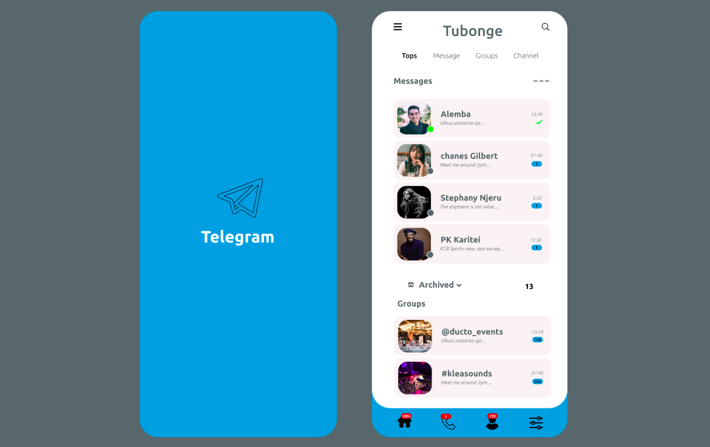

# Tubonge_Telegram

## A Collaborated app project

## Screenshot

## Table of Content

-[Description](#description)

-[Features](#features)

-[Collaborators](#developers-of-tubonge_telegram)

-[Requirements](#requirements)

-[Installation process](#installation-process)

-[Live Link](#Live-Link)

-[Technology Used](#technology-Used)

-[License](#license)

-[Authors Info](#Authors-info)

## Description

This is Social media app where users will be able to message, call and post their status/p>

[Go Back to the top](#Tubonge_Telegram)

## Features

This app contains, message/chatting section, calling button, dark-mode and light-mode button and status panel . 

[Go Back to the top](#Tubonge_Telegram)

## Developers of Tubonge_Telegram

|Behaviour |Input   |Output
|:---------:|:-------:|:-------:|
|Enter your name | Alemba Alex kiragu |    |
|Enter your Email Address |alembakiragu@gmail.com |    |
|Enter your name | (Newton Ombese) |    |
|Enter your Email Address |(write your email here) |    |
|Enter your name | (write your name here) |    |
|Enter your Email Address |(write your email here) |    |

[Go Back to the top](#Tubonge_Telegram)

### Requirements

*Access to a Computer or Smart phone

*Access to the internet

### Installation Process

****

*Clone the repo:https://github.com/alemba-21/Tubonge_Telegram.git

*Unzip the downloaded files in a folder of choice.

*Open the index files from the zipped file with any browser.
****

[Go Back to the top](#Tubonge_Telegram)

### Live Link

-Click this link to view the application: 

### Technology Used

*UI/UX DESIGN - Figma was used to design this app entirely

*REACT-JS -Which was used to give functionality to the project.

[Go Back to the top](#Tubonge_Telegram)

## Known Bugs

*There were no bugs discovered.

## License

Copyright(c) [2022][Alemba Alex]

Permission is hereby granted, free of charge, to any person obtaining a copy of this software and associated documentation files , to deal in the Software without restriction, including without limitation the rights to use, copy, modify, merge, publish, distribute, sublicense, and/or sell copies of the Software, and to permit persons to whom the Software is furnished to do so, subject to the following conditions:

The above copyright notice and this permission notice shall be included in all copies or substantial portions of the Software.

THE SOFTWARE IS PROVIDED "AS IS", WITHOUT WARRANTY OF ANY KIND, EXPRESS OR IMPLIED, INCLUDING BUT NOT LIMITED TO THE WARRANTIES OF MERCHANTABILITY, FITNESS FOR A PARTICULAR PURPOSE AND NONINFRINGEMENT. IN NO EVENT SHALL THE AUTHORS OR COPYRIGHT HOLDERS BE LIABLE FOR ANY CLAIM, DAMAGES OR OTHER LIABILITY, WHETHER IN AN ACTION OF CONTRACT, TORT OR OTHERWISE, ARISING FROM, OUT OF OR IN CONNECTION WITH THE SOFTWARE OR THE USE OR OTHER DEALINGS IN THE SOFTWARE.

## Authors Info

LinkedIn -(linkedin.com/in/alex-kiragu-754690219)

Email - (alembakiragu@gmail.com)

[Go Back to the top](#Tubonge_Telegram)